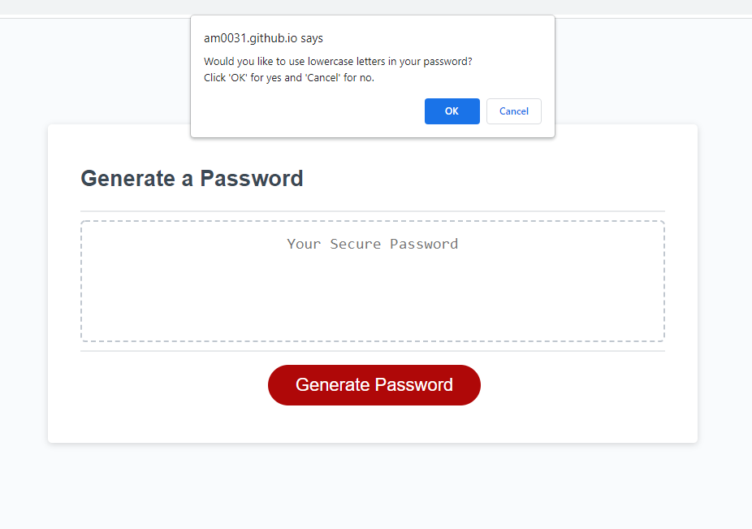

# Password generator

## What is this project about?

This project is about developing a password generator tool that takes in user inputs and creates a random password based on these inputs.

The requirements are as follow:

- When the user decides to generate a password, they will be prompted to enter the password length of their choice within an accepted range, and to decide for each group of character whether they want to use them for the generation of the password or not.
- The user must choose a password length between 8 and 128 characters. If this condition is not met, the user is alerted and invited to start again.
- The user must also select at least 1 group of characters between lowercase, uppercase, numbers and special characters. If this condition is not met, the user is alerted and invited to start again.
- When the right conditions are met, a random password will be created and displayed in the text box on the screen.

For repeatability, the user can press the "generate button" again to restart the cycle and generate a new random password.

For this project, the `HTML` and `CSS` structure were developed by another party. Only the `Javascript` code was developed for the steps to generate a password.

## Links to the project

Link to the deployed URL: [https://am0031.github.io/password-generator/](https://am0031.github.io/password-generator/)

Link to the Github Repository: [https://github.com/Am0031/password-generator](https://github.com/Am0031/password-generator)
Link to Github's pull request: [project ready for marking](https://github.com/Am0031/password-generator/pull/1)

## Screenshots of the live page

<details>
  <summary>Live page</summary>


</details>

<details>
  <summary>Prompt for password length</summary>


</details>

<details>
  <summary>Alert box for wrong input on password length</summary>


</details>

<details>
  <summary>Prompt for character options</summary>



</details>

<details>
  <summary>Alert box for wrong input on character options</summary>


</details>

<details>
  <summary>Password display in text area</summary>


</details>

## Technologies

HTML and CSS structures were already provided. The focus here was on developing the Javascript aspect of the password generator. For this we used arrow functions (ES6).

## Details of the steps followed

### Logic diagrams

The first step in developing the password generator was to lay down the logical path to follow:

- high level view - the overall logic from getting the user inputs to displaying the password to the user
  
- at function level - the inputs, outputs, and the general steps of each key function in our overall logic
    <details>
    <summary>function getPasswordLength</summary>

  

    </details>

    <details>
    <summary>function getUserOptions</summary>

  

    </details>

    <details>
    <summary>function createPassword</summary>

  

    </details>

When tracing the logic of the functions, it was thought best that:

- To ensure that the code doesn't get stuck in endless loops, when the user does not provide the right input, he is presented with an alert box and subsequently returned to the beginning of the cycle with a page reload

- To ensure that the user obtains a password which includes all the chosen characters and is random, the creation of the password should be split into 3 steps:
  - A first step where the code goes through each group (or string) of characters selected by the user in order, and selects a random character within each string _(to make sure each string is selected at least once)_
  - A second step where the code continues to select random characters in a randomly selected string, until it reaches the desired password length
  - A third step where the obtained collection of characters is shuffled to ensure their distribution is sufficiently random

The complete logic diagram can be found as a [pdf file](https://github.com/Am0031/password-generator/blob/dev/assets/password-generator-logic.pdf) in the **assets** folder in the project's [github repository](https://github.com/Am0031/password-generator/tree/dev).

This provided the foundation for the code structure and supported writing the pseudo-code and declaring the main functions.

<details>
    <summary>See this screenshot of the high level pseudo code and functions</summary>


</details>

### Functions - Code structure

When developing the functions, the focus was on:

- declaring the relevant variables required for the function
- structuring the function correctly, using where appropriate:
  - prompt and confirm (for interaction with user)
  - parseInt (for conversion to number)
  - for loops (for repeated actions)
  - if/else statements (for conditional actions)
  - math.floor/math.random (for the generation of random numbers)
  - push function (for pushing item into array)
  - join function (for conversion to string)
  - shuffle function (for random order of the characters) _(the code for this function was found [here](https://stackoverflow.com/questions/2450954/how-to-randomize-shuffle-a-javascript-array))_

See below screenshots of the code for each function _(with explanatory comments in code)_

<details>
  <summary>Code for Function getPasswordLength</summary>


</details>

<details>
  <summary>Code for Function getPasswordOptions</summary>


</details>

<details>
  <summary>Code for Function createPassword (shown before refactoring - see refactoring steps and final code below)</summary>


</details>

## Refactoring the code for better readability

After the code was built and functional, it was important to review it for possible adjustments and improvements.
The following aspects were worked on at this stage:

### Assigning Let and Const variables

Review of let and const allocation for all function variables, and amendments were made where a few variables previously declared as let were adjusted to const.

This [article](https://www.freecodecamp.org/news/var-let-and-const-whats-the-difference/) provides a thorough explanations of the different uses of var, let and const.

### Optimising loops and Use of Ternary operator

Review for optimisation of the code, where loops and if/else statements can be modified for a cleaner syntax.
As an example, let's look at the first part of the createPassword function and how it has evolved with refactoring reviews.

<details>
<summary> 1- We started with a working code which followed our logic plan, with a rough structure of 2 `for` loops </summary>

```javascript
//1st draft code - working
//function createPassword - 1/2 - create a temporary password based on user inputs
const createPassword = (passwordLength, chosenOptions) => {
  let draftPassword = [];

  //loop to extract 1 character from each string
  for (let i = 0; i < chosenOptions.length; i += 1) {
    let randomNumber = Math.floor(Math.random() * chosenOptions[i].length);
    draftPassword.push(chosenOptions[i][randomNumber]);
  }

  //loop to extract 1 character from randomly selected string until password length is reached
  for (let i = chosenOptions.length; i < passwordLength; i += 1) {
    let randomArray = Math.floor(Math.random() * chosenOptions.length);
    let randomNumber = Math.floor(
      Math.random() * chosenOptions[randomArray].length
    );
    draftPassword.push(chosenOptions[randomArray][randomNumber]);
  }

  return draftPassword;
};
```

</details>

<details>
<summary> 2- We looked at combining the for loops, and introduced a if/else statement for that purpose </summary>

```javascript
//refactoring - 1st pass - combining code into 1 for loop
//function createPassword - 1/2 - create a temporary password based on user inputs
const createPassword = (passwordLength, chosenOptions) => {
  let draftPassword = [];

  //loop to extract 1 character from a string until password length is reached
  for (let i = 0; i < passwordLength; i += 1) {
    if (i < chosenOptions.length) {
      let randomNumber = Math.floor(Math.random() * chosenOptions[i].length);
      draftPassword.push(chosenOptions[i][randomNumber]);
    } else {
      let randomArray = Math.floor(Math.random() * chosenOptions.length);
      let randomNumber = Math.floor(
        Math.random() * chosenOptions[randomArray].length
      );
      draftPassword.push(chosenOptions[randomArray][randomNumber]);
    }
  }

  return draftPassword;
};
```

</details>

<details>
<summary> 3- With the new structure in place, we looked at removing repetitions in the code and leave only the essentials in the if/else statement, other lines being now at function level </summary>

```javascript
//refactoring - 2nd pass - removing code repetition in loop
//function createPassword - 1/2 - create a temporary password based on user inputs
const createPassword = (passwordLength, chosenOptions) => {
  let draftPassword = [];
  let chosenArray;

  //loop to extract 1 character from a string until password length is reached
  for (let i = 0; i < passwordLength; i += 1) {
    if (i < chosenOptions.length) {
      chosenArray = i;
    } else {
      chosenArray = Math.floor(Math.random() * chosenOptions.length);
    }
    let randomNumber = Math.floor(
      Math.random() * chosenOptions[chosenArray].length
    );
    draftPassword.push(chosenOptions[chosenArray][randomNumber]);
  }

  return draftPassword;
};
```

</details>

<details>
<summary> 4- With a clean if/else statement, we looked at introducing a ternary operator to optimise further this part's syntax, and we also reviewed the type for each variable. </summary>

```javascript
//refactoring - 3rd pass - adding ternary operator and checking variable type
//function createPassword - 1/2 - create a temporary password based on user inputs
const createPassword = (passwordLength, chosenOptions) => {
  const draftPassword = [];

  //loop to extract 1 character from a string until password length is reached
  for (let i = 0; i < passwordLength; i += 1) {
    const chosenArray =
      i < chosenOptions.length
        ? i
        : Math.floor(Math.random() * chosenOptions.length);

    const randomNumber = Math.floor(
      Math.random() * chosenOptions[chosenArray].length
    );
    draftPassword.push(chosenOptions[chosenArray][randomNumber]);
  }

  return draftPassword;
};
```

</details>

This [MDN page](https://developer.mozilla.org/en-US/docs/Web/JavaScript/Reference/Operators/Conditional_Operator) is a great starting point to get some information on how a ternary operator works.

Result: See below the snippet of the final code _(without the comment lines for a cleaner view)_ :

```javascript
const createPassword = (passwordLength, chosenOptions) => {
  const draftPassword = [];
  for (let i = 0; i < passwordLength; i += 1) {
    const chosenArray =
      i < chosenOptions.length
        ? i
        : Math.floor(Math.random() * chosenOptions.length);
    const randomNumber = Math.floor(
      Math.random() * chosenOptions[chosenArray].length
    );
    draftPassword.push(chosenOptions[chosenArray][randomNumber]);
  }
  return;
  draftPassword;
};
```

<details>
  <summary>Complete final Code for Function createPassword (with the explanatory comments) </summary>


</details>

## Functionalities and Limitations

While this page creates a password, it does not offer other features. This is due to the fact that the provided `HTML` and `CSS` were purposefully left untouched.
However, other complementing features to this page could be for example : adding a "copy to clipboard" button when the password is generated, adding a redirection button (if page is part of a larger project).
